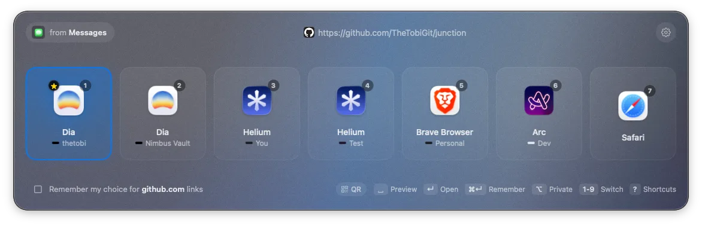
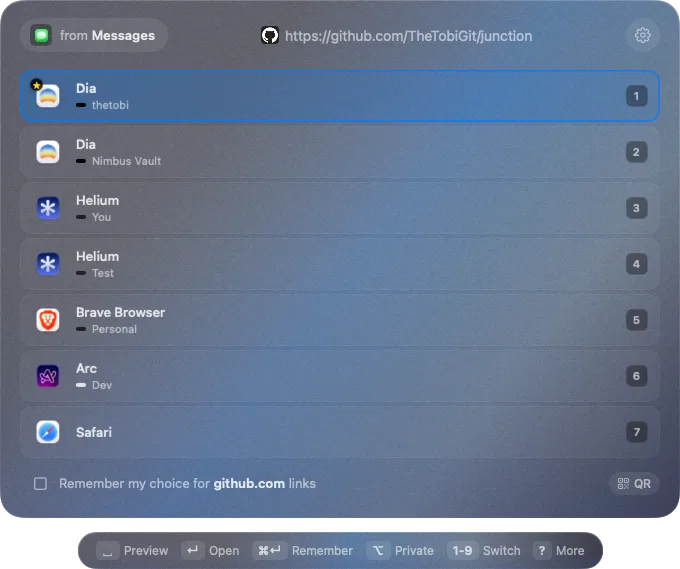
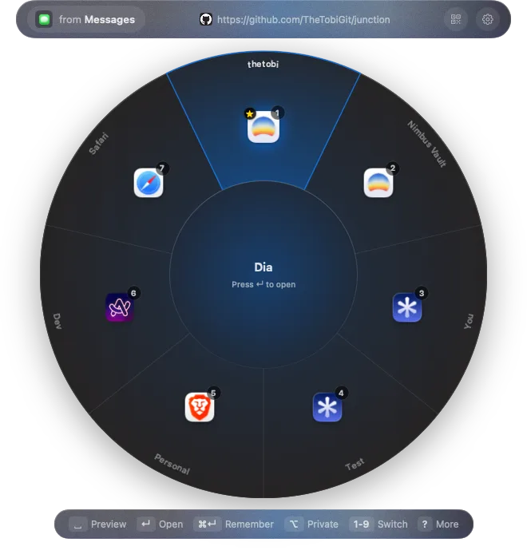

<div align="center">


# Junction

### Route every link you click.

A small, fast, keyboard-first link router for macOS. Junction lives in your menu bar and hands every click to the right browser, profile, or private window — **one keystroke ends it.**

[](https://github.com/TheTobiGit/junction/releases/latest)
[](https://github.com/TheTobiGit/junction/releases/latest)
[](./LICENSE)

<br>



</div>

---

## Why

Click a link in Slack, Mail, or a PDF and macOS sends it wherever your default browser happens to be — wrong profile, wrong window, every time. Junction puts a junction in the middle of that hallway. Click anywhere, hit a number, land where you meant to. No mouse, no tab roulette.

- **Keyboard-first.** The picker opens already listening. A number key sends the link and closes it.
- **Profile-aware.** Every browser *and* profile gets its own slot — Chrome Work, Chrome Personal, Arc, Safari Private.
- **Rule-driven.** Teach a host once and it skips the picker forever.
- **Local.** No account, no telemetry, no network call. ~18 MB, notarized.

## Install

Download the latest [release](https://github.com/TheTobiGit/junction/releases/latest), drag it to Applications, and set Junction as your default browser when it asks on first launch. From then on, every link reports to the junction before it goes anywhere. Switch back anytime in System Settings.

## Use

Click any link and the picker appears, already listening for a key:

| Key | Action |
|---|---|
| `1`–`9` | Open in that slot — every browser and profile gets a number |
| `↵` | Open the highlighted slot (arrows move the highlight) |
| `⌥` (hold) | Open any slot as a private/incognito window |
| `␣` | Preview the page inside the picker before you commit |
| `⌘↵` | Remember — bind this host to this slot and skip the picker next time |
| `⌘C` | Copy the cleaned URL |
| `?` | Cheat sheet |
| `esc` | Cancel — the link goes nowhere |

Three picker views ship in the box — **tile**, **list**, and **dial**. Same slots, same shortcuts; pick your default in settings.

<div align="center">

&nbsp;&nbsp;

</div>

## Rules

Teach Junction once and retire the picker for a host. One line in your terminal binds a host to a destination:

```sh
junction rules add github.com --in profile:com.google.Chrome:Default
```

More of what the CLI can do:

```sh
junction rules add twitter.com --incognito app:com.apple.Safari   # always private
junction rules add reddit.com --block                             # refuse to open
junction rules add "^.*slack\.com" --regex --ask                  # match by regex, still prompt
junction rules add slack.com --scheme slack                       # hand off to an app's URL scheme
junction rules list                                               # see everything bound
junction targets                                                  # list known target keys
junction inspect "https://l.facebook.com/l.php?u=..."             # show how a URL resolves
```

Anything not bound still goes through the picker — nothing is hidden. Allergic to terminals? Hit `⌘↵` **remember** in the picker instead. Run `junction --help` for the full command list.

## Build from source

Requires Xcode 15+ on macOS 13+.

```sh
git clone https://github.com/TheTobiGit/junction
cd junction
./scripts/setup.sh
./build-app.sh release
open build/Junction.app
```

`scripts/setup.sh` installs the commit-msg hook that enforces [Conventional Commits](https://www.conventionalcommits.org/). See [DEVELOPMENT.md](./DEVELOPMENT.md) for more.

## Contributing

Issues and PRs welcome. Open an issue first for non-trivial changes. Commits must follow Conventional Commits.

## Security

See [SECURITY.md](./SECURITY.md) for private disclosure.

## License

MIT. See [LICENSE](./LICENSE).
